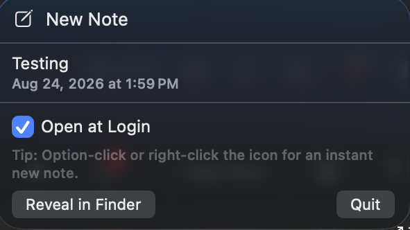
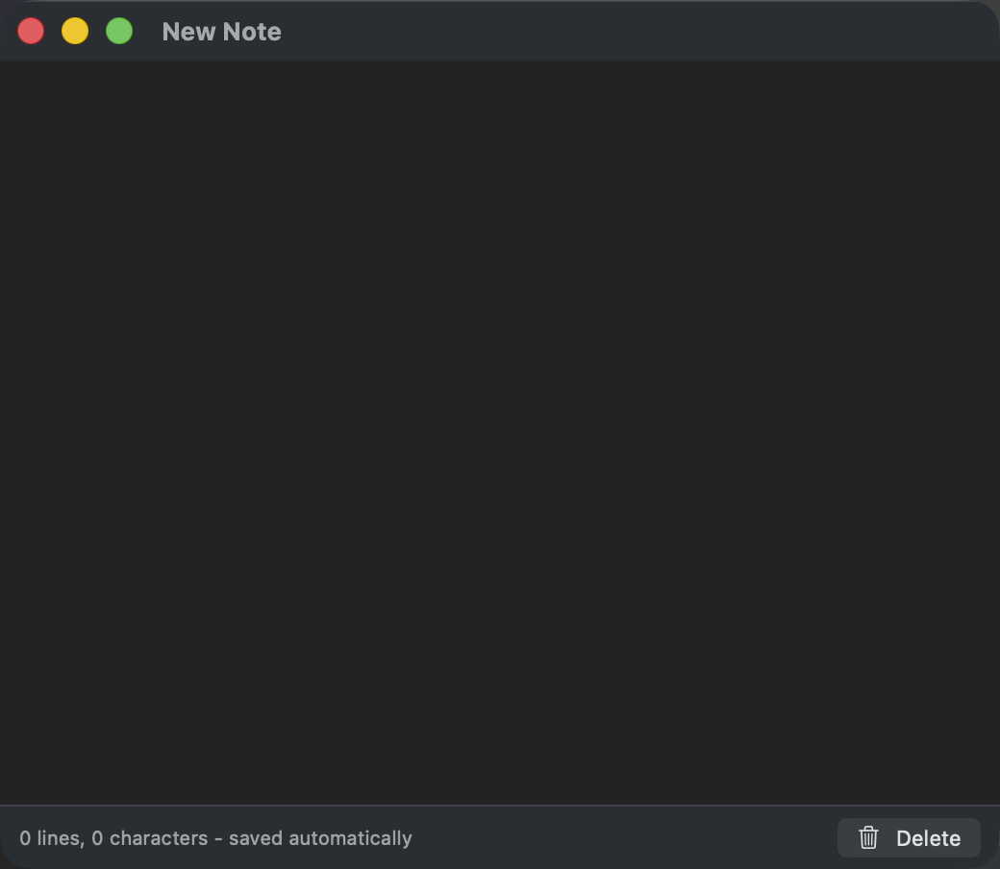

# NoFormatNotes

A menu bar scratchpad. Plain text, local only, saves itself.

For dumping something somewhere fast — an API key, a snippet, a chunk of text you need stripped of
formatting — without opening an editor, picking a folder, or naming a file.

<p align="center">
  
  &nbsp;
  
</p>

## Using it

- **Option-click the menu bar icon** for an instant new note. Right-click does the same.
  (Not Command-click: macOS reserves that for dragging menu bar icons around.)
- **Click the icon** to see your notes. Click one to open it.
- **Hover a note** and click the trash to delete it.
- **Open at Login** keeps it there after a restart.

There is no save button. Typing saves within half a second; closing a window, switching apps or
quitting saves immediately.

## Plain text, actually plain

Paste anything — a web page, a rich email — and the styling is gone. Copy back out and only plain
text goes to the clipboard, so the formatting cannot come back when you paste it on. That is the
Notepad round-trip, without Notepad.

It also fixes what Notepad leaves alone: smart quotes, em dashes, non-breaking spaces, zero-width
characters and BOMs, all of which look normal and break whatever you paste them into.

Keys and tokens pass through byte for byte. That is the first thing the tests check.

## Where notes live

```
~/Library/Application Support/NoFormatNotes/
```

One `.txt` per note. Not in Documents or Desktop, which get swept into iCloud when Desktop &
Documents syncing is on. Nothing leaves the machine: no sync, no network, no telemetry.

The folder is `0700`, notes are `0600`, it is excluded from Spotlight, and deleting a note
overwrites its bytes first.

**Notes are not encrypted.** Anyone with access to your unlocked Mac can read them. It is a
scratchpad, not a password manager.

## Updating

NoFormatNotes checks GitHub for new releases once a day. **Nothing installs itself.** When an update
exists the menu bar icon shows a badge, and you choose whether to install it.

Installing downloads the image, checks the app inside is signed by the same developer as your copy
and passes Gatekeeper, then replaces the installed app and relaunches. No password: nothing outside
`/Applications` is touched.

## Installing

Download the `.dmg`, open it, drag NoFormatNotes to Applications. Signed and notarized, so no warnings.

## Building

Command Line Tools are enough; Xcode is not used.

```bash
make        # universal signed app
make test   # text handling and storage
make dmg    # distributable disk image
```

## AI disclosure

Built with AI assistance. Behaviour described here was verified against a running system, not
assumed.

## Licence

MIT.
